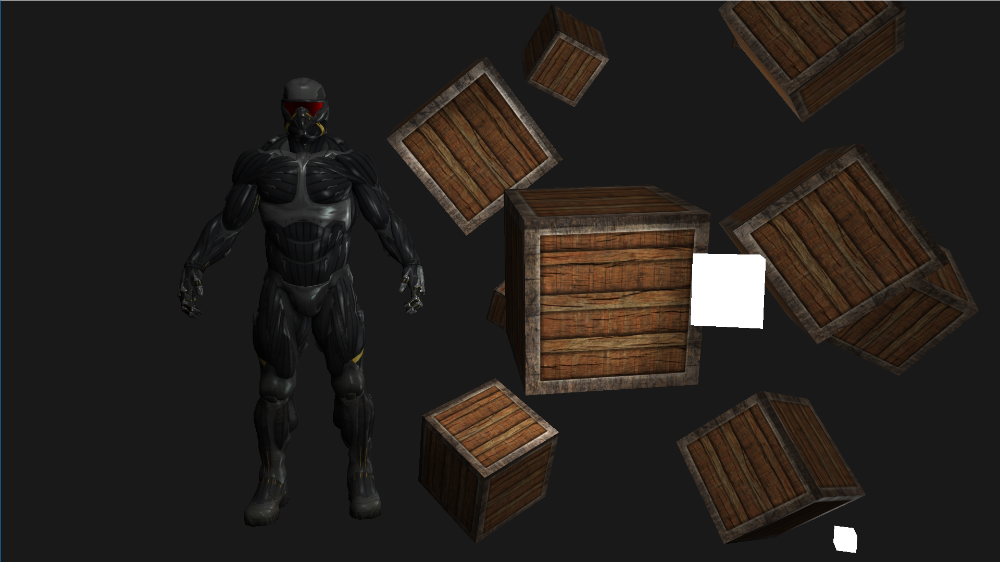

# 3DPlayground
Exploring OpenGL, basically creating a 3D engine from scratch and learning on the go. I am mostly quided by the brilliant tutorials at [Learn OpenGL](https://learnopengl.com/), but other resources proved very useful as well. 

Ultimately it should be a fully functional and easy to implement engine for any game or program that I might create in the future.

## Screenshot

### Libraries used:
* GLFW
* GLEW
* GLM
* Assimp
* STB

### TODO
- [x] Diffuse and specular textures
- [x] Model loading from .obj files
- [x] Multiple lights
- [ ] Normal maps
- [ ] Proper classes
- [ ] Animation
- [ ] Colisions
- [ ] UI
- [ ] PBR
- [ ] A lot more...
- [ ] And more...
- [ ] ...
